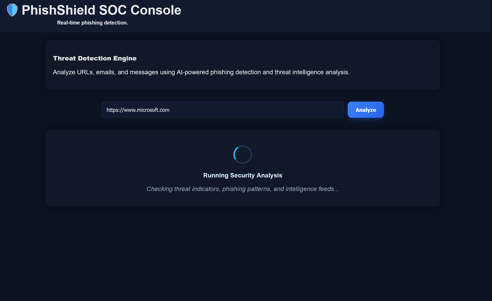
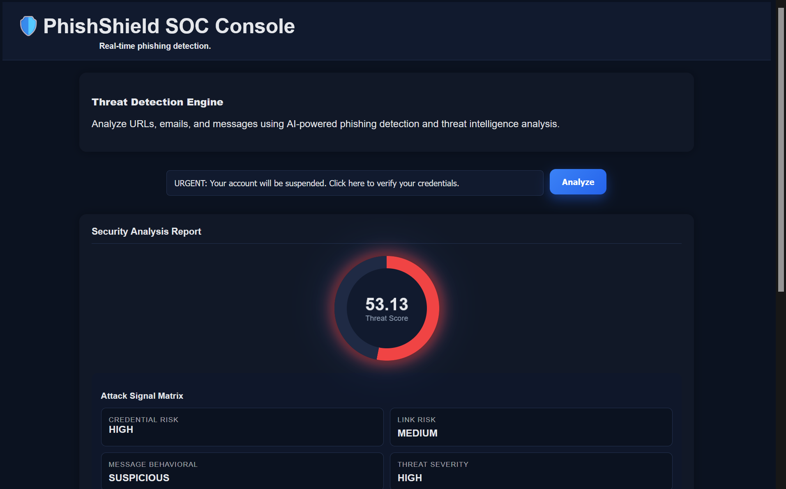
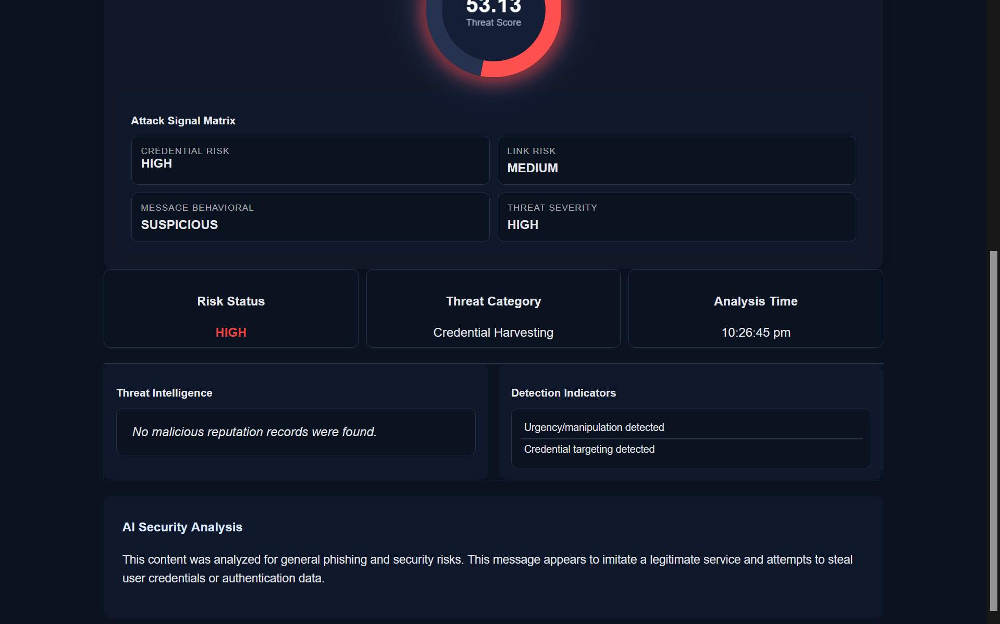
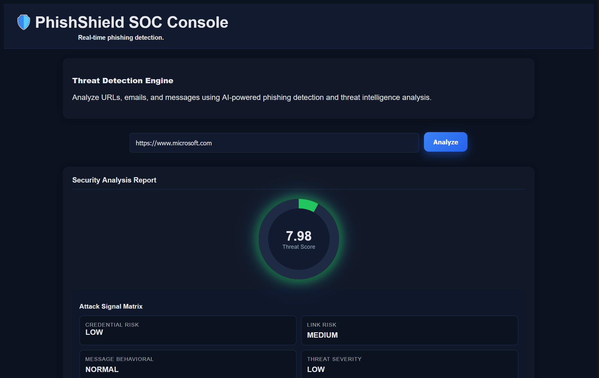
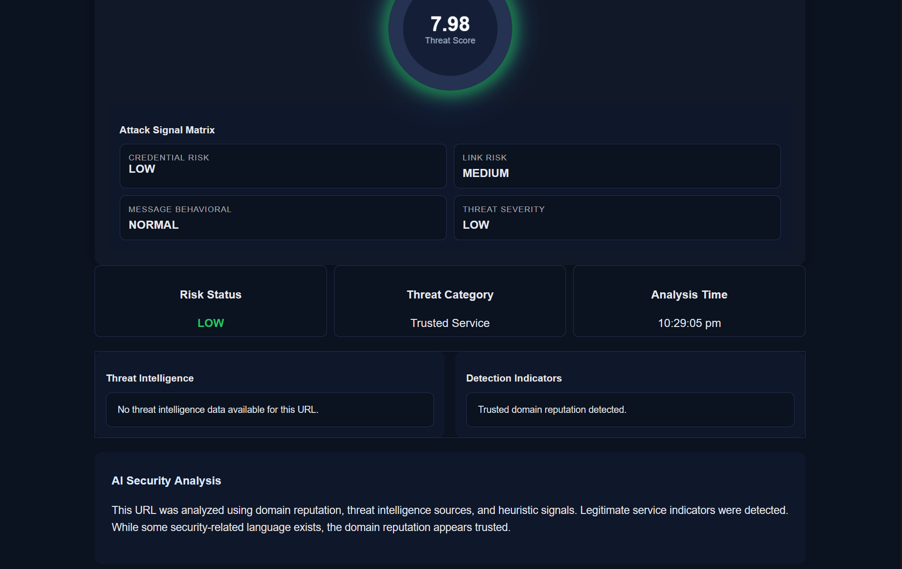

# PhishShield Security Console

## Overview

PhishShield is a web-based phishing detection and threat analysis platform designed to identify potentially malicious URLs, emails, and messages.

The system combines machine learning classification, threat intelligence analysis, and security-focused reporting to help users evaluate phishing risks through an interactive dashboard.

## Features

* Machine Learning Based Phishing Detection
* Threat Scoring and Risk Assessment
* Detection Indicator Analysis
* Threat Intelligence Integration
* Security Explanation Engine
* Interactive Security Operations Center (SOC) Style Dashboard
* Real-Time Analysis Interface

## Technology Stack

### Backend

* Python
* Flask
* Scikit-Learn

### Frontend

* HTML
* CSS
* JavaScript

### Data Processing

* Pandas
* NumPy

### Threat Intelligence

* External reputation and intelligence lookups

## Project Structure

PhishShield/
│
├── app.py
├── detector.py
├── ml_model.py
├── threat_intel.py
├── requirements.txt
├── README.md
├── phishing_model.pkl
├── vectorizer.pkl
├── templates/
   └── index.html

## Screenshots

### Analysis Workflow

Loading screen displayed while phishing indicators, threat intelligence feeds, and security signals are being processed.



### High-Risk Phishing Detection

Dashboard overview showing threat score, attack signal matrix, and risk assessment.



Detailed analysis showing threat intelligence, detection indicators, and security assessment.



### Benign / Low-Risk Analysis

Dashboard overview for a legitimate input with low threat score and reduced risk indicators.



Detailed analysis showing intelligence results and explanation output.



## API Integration

This project uses the VirusTotal API for threat intelligence and reputation analysis.

To use VirusTotal features:

1. Create a VirusTotal account.
2. Generate an API key.
3. Add the key to a .env file:

VT_API_KEY=your_api_key_here

## Installation

Clone the repository:

```bash
git clone <repository-url>
cd phishshield-security-console
```

Install dependencies:

```bash
pip install -r requirements.txt
```

Run the application:

```bash
python app.py
```

Open:

```text
http://127.0.0.1:5000
```
## Usage

1. Enter a URL, email, or message.
2. Start analysis.
3. Review:

   * Threat Score
   * Risk Status
   * Threat Category
   * Detection Indicators
   * Threat Intelligence Results
   * Security Analysis

## Future Improvements

* Domain WHOIS Analysis
* Email Header Inspection
* Real-Time Threat Feed Integration
* Multi-Model Detection Pipeline
* Historical Threat Tracking
* Advanced SOC Monitoring Features

## Educational Purpose

This project was developed to explore practical applications of machine learning and cybersecurity concepts in phishing detection and threat analysis.